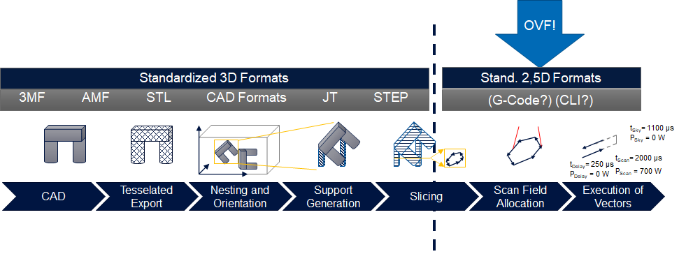
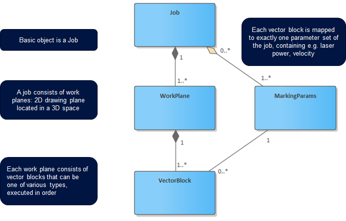
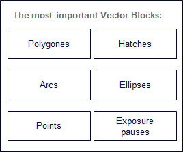

# OpenVectorFormat

A format description based on Google protobuf. The format is used for controlling a laser in combination with a galvanometer scanner. It supports multi scanfield arrays as well as additional machine axis controls.

## Why another format?

The first question to adress is for course: why another format? Often, the introduction of a new format to "unify all the existing ones" leads to a situation of there just being yet another format, as beautifully shown in this [xkcd](https://xkcd.com/927/).

### Status quo
In scanner-based laser manufacturing, a process chain typically starts with the generation of the structure to be processed in some CAD application, where there are several formats such as STEP (STandard for the Exchange of Product model data) or STL (Standard Tessellation Language) that can be used in a wide variety of tools - thus, a favorable situation of two very capable, widely supported de-facto standards.

For laser processing with a galvanometer scanner, this 3D geometry data needs to be converted into a collection of 2D layer data. This conversion is usually done through a slicer – and for the output of the slicer, there is no standard format with wide industry support.

Currently, various formats are used:
- There is G-Code, which was originally designed for very different applications, and is thus lacking some of the requirements such as defining various laser and scanner parameters.

- There are specialized formats written for exactly one use-case with limited documentation and capabilities for a broader application. 

Nearly all of the formats lack the capability to store meta-data about parts and processing steps, which is required to associate process monitoring information with specific steps of the processing job. 

This is exactly the point where OpenVectorFormat plugs into the data pipeline.

Thus, we are confident that the OpenVectorFormat will not be "just another format" alongside other, similarily well suited formats. It is the first truly open, feature rich format for the growing range of scanner based laser applications.

## Basic Object Model

The basic object model of the Open Vector Format is derived from the layer wise build up process of 2.5D manufacturing processes and shown in the figure below.

### Job

The job object represents the whole job the machine shall manufacture. It is the root object of the model. Contained in the job are two data objects: A list of WorkPlane objects and a map of MarkingParams objects. 
This data objects contain all information that is required for the machine to manufacture the job. Additionally, the job contains several metadata objects.
Most important of these metadata objects is the Part object map.

### WorkPlane

The WorkPlane object represents a two-dimensional drawing plane located in three-dimensional space, its name derives from the CAD concept with similar function. 
The WorkPlane is probably the most defining object since it shows and limits the use case of the Open Vector Format.

The object model aims at processes that use a motion system (e.g. (multi-)axis system, industrial robot) to position a build object 
(e.g. LPBF build plate, object to be structured / engraved) relative to a vector based actuator (e.g. galvanometer scanner with laser source, magnetic field deflector with electron beam). The movements of both actuators are expected to happen consecutively and not simultaneous. Thus e.g. for LPBF the z-axis first moves the build plate into the correct height and after the movement is finished the laser actuator starts vector execution. 
Goal coordinates for the motion system are stored in the work plane object itself.

### VectorBlock

The VectorBlock object represents a set of vectors that share the same metadata and process parameter set. Each vector block is mapped to one specific set of marking parameters from the job via an index. 
The VectorBlock object exists mainly for performance reasons and storage space efficiency. Vector blocks can adapt one of several available types that define how exactly the point coordinate data is stored and shall be interpreted by the machine controller software. The most common VectorBlock types are “Hatches” and “LineSequences” (also known as polygones).
Hatches are defined as a set of straight lines that are not connected to each other and are commonly used to create the “filling” of parts. LineSequences are a set of connected straight line segments that are commonly used to create closed contours lines. Vector block types act as a flexible extension point of the format. The machine controller software can check the vector block type and can only execute known types.
 
If a specialized vector block type is beneficial for a use case, both the vector generating code as well as the machine controller can be extended to support other types while still utilizing the other parts of the job structure. For example arcs and ellipses have been added as additional vector block types. This geometric shapes can directly be executed by some galvanometer controller cards and are more efficient for manufacturing e.g. lattice structures than representing the circular contours with polygons. 

Additionally for multi-laser machines each vector block can store an index of the executing laser unit if the vector allocation is generated upfront and not on the machine.

### Marking Params

The MarkingParams object contains process parameters for the execution of the vectors like marking speed, power and abstract parameters for configuring the closed loop controller that controls the laser beams positional accuracy. This includes feed-forward parameters like delays as well as acceleration and deceleration compensation (“Skywriting”) set points like prerun and postrun times. It is up to the machine controller software to calculate the real set points from the abstract description considering the hardware components specifications, safety limits etc.

### Meta data
The basic objects Job, WorkPlane and VectorBlock contain additional fields for meta data related that object. The most relevant Metadata object is the Part. 
Many AM processes like LPBF create a whole batch of parts at once that get separated later. The information about the part relationship is not relevant for the printing process itself, but highly relevant for applications that process the data after slicing. Especially quality assurance applications need this relationship to connect data that is generated during or after AM processing like process monitoring sensor data and quality control measurements with the machine code.

## The tech behind
The OpenVectorFormat description is based on Google Protobuf. Protobuf already satisfies many of the technical requirements for a format like this:
- Offering a space efficient binary encoding to handle large jobs with multiple gigabytes of data
- High (de)serialization performance in various languages including C++, C#, Java and Python.
- An easy way to implement a streaming concept on top of it
- With gRPC as remote procedure call framework, communication and seamless transfer of the data between multiple applications is easily possible.
- Easily extensible with backwards compatibility by default

## How to use
The recommended way to use OpenVectorFormat in your software is to use our reference implementation [OpenVectorFormatTools](https://github.com/Digital-Production-Aachen/OpenVectorFormatTools). It provides basic tooling for a seamless integration in C#, e.g. a file reader / writer with streaming support, consistency checks for jobs, and a gRPC wrapper for easy use with other languages.

If you prefer not to use those tools, you can either use the [Workspace](WORKSPACE) file to pull & build standalone versions of the Protobuf & gRPC libraries in your `bazel` workflow. Or just take the [open_vector_format.proto](open_vector_format.proto) file directly. In this case, you should be knowing what you are doing since you need to integrate the protobuf and gRPC libraries manually into your software.